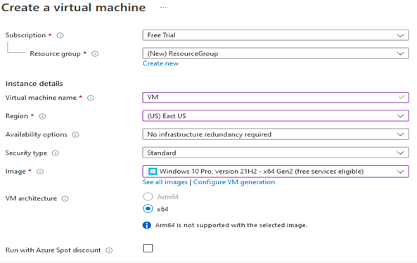

# Cyber-Attacks-Map---Using-Azure-Sentinel-SIEM

<h2>Description</h2>
Project consists of a creating a Sensitivity Label. 
 Configured Log Analytics Workspace in Azure to ingest custom logs containing geographic information (latitude, longitude, state/province, and country).
• Configured Custom Fields in Log Analytics Workspace with the intent of mapping geo data in Azure Sentinel.
• Configured Azure Sentinel (Microsoft's SIEM) Workbook to display global attack data (RDP brute force) on world map according to physical location and magnitude of attacks.
<br/>

<h2>Environments Used </h2>

- <b>Microsoft Azure Trial </b> 
- <b>Remote Desktop Communication</b>

<h2>Prerequisites</h2>

- <b> Licenses: Microsoft Azure Trial or above</b>

<h2>Program walk-through:</h2>

<h3>Steps: </h3>

1. Create Azure Subscription
2.	Create Virtual Machine
3.	Firewall turn off / allow all in firewall
4.	Create Log Analytics Workspace
5.	Enable gathering VM logs in Security Center
6. Connect Log Analytics to VM
7. Setup Azure Sentinel
8. Log into VM with Remote Desktop
9. Observe Event viewer Logs in VM
10. Turn of Windows Firewall on VM
11. Running a powershell script
12. Get Geolocation.io API Key
13  Run Script To get Geo Data from attackers
14. Create custom log in LAW to bring in our custom log
15. Create custom fields/extract fields from raw custom log data
16. Testing Extracts
17. Setup map in sentinel with Latitude and Longitude (or country)
18. Fixing Map plot sizes
19. Final check on map


<h3>Screenshots:</h3>

<p align="center">
Create Virtual Machine: <br/>

<br/>

<br />
<br />
Firewall turn off / allow all in firewall: <br/>

<br />
<br />
Create Log Analytics Workspace: <br/>

<br />
<br />
Watermark: <br/>

<br />
<br />
Select Sensitivity info type: <br/>

<br />
<br />
Result: <br/>

<br />
<br />


</p>

<!--
 ```diff
- text in red
+ text in green
! text in orange
# text in gray
@@ text in purple (and bold)@@
```
--!>
